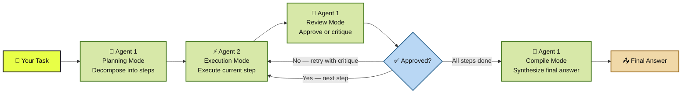

<a name="top"></a>

<p align="center">
  
</p>

<h1 align="center">DuOgent</h1>
<h3 align="center">Two agents. One plans. One executes. Both argue.</h3>

<p align="center">
  <strong>A dual-agent AI system where one model breaks down your task, another executes each step, and neither stops until the output is actually good.</strong>
</p>

<p align="center">
  <sub>DuOgent combines planning, execution, review loops, and real-time streaming into one self-correcting AI pipeline — powered entirely by Pollinations.ai.</sub>
</p>

<p align="center">
  
  
  
  <a href="LICENSE"></a>
</p>

<p align="center">
  <a href="https://github.com/iFreaku/DuOgent/stargazers"></a>
  <a href="https://github.com/iFreaku/DuOgent/network/members"></a>
  <a href="https://github.com/iFreaku/DuOgent/issues"></a>
  
</p>

<p align="center">
  
</p>

---

## 🧭 Quick Navigation

- [🎯 What Is DuOgent?](#what-is-duogent)
- [💡 The Idea](#the-idea)
- [⚙️ How the Loop Works](#how-the-loop-works)
- [🚀 What Can It Do?](#what-can-it-do)
- [✨ Features](#features)
- [⬡ BYOP — Bring Your Own Pollen](#byop)
- [🏁 Getting Started](#getting-started)
- [🗂️ Project Structure](#project-structure)
- [📦 Stack](#stack)
- [🌐 Deployment](#deployment)

---

<a id="what-is-duogent"></a>

## 🎯 What Is DuOgent?

DuOgent is a **dual-agent AI pipeline** built for tasks that are too important to get right on the first try.

It takes your task, splits it into the minimum number of steps needed, has one AI execute each step, and another AI reject it until it's actually good. No one-shot guessing. No silent failures. Just a self-correcting loop that argues until the output is worth using.

- 🧠 **Agent 1 — Planner/Reviewer:** The uptight one. Decomposes your task into focused steps, then reviews every output like a senior dev on a Friday afternoon.
- ⚡ **Agent 2 — Executor:** The one that does the work. Gets the full context — original task, complete plan, current step, and any critique from the last attempt. No excuses.
- 📡 **Real-time streaming:** Watch every step execute live via Server-Sent Events. Nothing happens behind the scenes.
- ⬡ **BYOP:** Users connect their own Pollinations.ai account. You host the app, they cover the AI costs. $0 for you.

**Best fit:** Developers, writers, researchers, and anyone who's tired of copy-pasting AI output into another prompt to fix it.

### How the Pipeline Flows



---

<a id="the-idea"></a>

## 💡 The Idea

Every AI tool gives you one shot. You type, it responds, you get something that's *almost* right — and now you're copy-pasting it into another prompt to fix it.

DuOgent automates that entire exhausting back-and-forth by making two agents do it instead of you.

> *"It's not who I am underneath, but what I do that defines me."* — Batman Begins

Agent 2 always sees the **original task** and the **full plan**. Not just `"write the HTML structure"` with zero context. It knows what it's building, why, and where this step fits. Agent 1 won't let it get away with a half-baked output — it reviews every result and sends it back with a specific critique if it's not good enough.

The loop runs until Agent 1 approves or the retry limit hits. Either way, you get a compiled, synthesized final answer at the end.

---

<a id="how-the-loop-works"></a>

## ⚙️ How the Loop Works

```
Your task
    │
    ▼
Agent 1 — Planning Mode
    Breaks task into minimum necessary steps
    │
    ▼ for each step...
    │
    ├─► Agent 2 — Execution Mode
    │       Full task + full plan + current step + any critique
    │
    ├─► Agent 1 — Review Mode
    │       ├── "approved" → move to next step
    │       └── "fix this specific thing" → Agent 2 retries
    │
    ▼ all steps approved
Agent 1 — Compile Mode
    Synthesizes all results into one final answer
```

<p align="right"><a href="#top">⬆️ Back to top</a></p>

---

<a id="what-can-it-do"></a>

## 🚀 What Can It Do?

### 🖥️ Build Web Apps
Ask it to build a todo app, a calculator, a landing page. Agent 2 writes the code, Agent 1 reviews it — and if the output is a single-file HTML, it **auto-saves to `/static`** and renders in a live iframe preview inside the UI. Preview it, resize it, download it.

### 📝 Long-Form Writing
Blog posts, technical docs, research articles, product specs. The planner breaks it into sections, the executor writes each one with full memory of what came before.

### 🔬 Multi-Step Research
*"Explain transformer architecture, its evolution, and current limitations."* Not a one-shot prompt. A structured plan with reviewed steps.

### 📧 Content Pipelines
Email sequences, onboarding flows, social copy. Each piece reviewed before the next one starts.

### 💻 Code Generation
Scripts, components, utilities. Agent 1 actually checks if the code is coherent before you ever see it.

---

<a id="features"></a>

## ✨ Features

- ⬡ **BYOP** — Bring Your Own Pollen. Users connect their own [Pollinations.ai](https://pollinations.ai) account. You host the app, they cover AI costs. $0 for you.
- 🎛️ **Per-agent model selection** — different model for Agent 1 and Agent 2. Run a smart planner with a fast executor.
- 📡 **Real-time streaming** — watch every step execute live via Server-Sent Events.
- 🗂️ **Step tracker** — sidebar shows every step with live status: running / approved / retrying / forced.
- 💾 **HTML auto-save** — generated web apps saved to `/static`, previewed in iframe, downloadable.
- 🔒 **localStorage persistence** — your key, models, and all settings survive page refreshes.
- ⚙️ **Param toggles** — enable/disable Temperature, Top P, Presence/Frequency Penalty individually.
- 📱 **Mobile responsive** — hamburger menu, slide-in sidebar, works on phone.
- ✕ **Cancel mid-run** — AbortController stops the stream instantly.

<p align="right"><a href="#top">⬆️ Back to top</a></p>

---

<a id="byop"></a>

## ⬡ BYOP — Bring Your Own Pollen

DuOgent runs on **[Pollinations.ai](https://pollinations.ai)** — free, open AI inference with access to models from OpenAI, Google Gemini, Mistral, DeepSeek, and more.

BYOP is Pollinations' auth flow that makes zero-cost hosting possible. Users click **Connect with Pollinations**, sign in, approve access, and get redirected back with a key in the URL fragment (never hits server logs). The app picks it up, saves it to localStorage, and they're ready to run.

```javascript
// Optional: set your publishable key so the consent screen
// shows "DuOgent" instead of just your hostname
const BYOP_APP_KEY = 'pk_yourkey'; // in templates/index.html
```

Register yours at [enter.pollinations.ai](https://enter.pollinations.ai).

> *"Why are you trying to hit me? Hit the target!"* — The Last Samurai

---

<a id="getting-started"></a>

## 🏁 Getting Started

```bash
git clone https://github.com/iFreaku/DuOgent.git
cd DuOgent
pip install -r requirements.txt
python server.py
```

Open `http://localhost:5000`. Click **⬡ Connect with Pollinations** or paste a key manually. Pick models for each agent. Write your task. Hit Execute.

> *"Oh yes, it is happening."* — Elf

---

<a id="project-structure"></a>

## 🗂️ Project Structure

```
DuOgent/
├── dual_agent.py       # The two-agent loop — plan, execute, review, compile
├── server.py           # Flask backend — SSE streaming, /api/run, /api/save
├── requirements.txt
├── templates/
│   └── index.html      # Entire frontend. One file. No build step.
└── static/             # Generated HTML outputs land here (auto-created)
```

No node_modules. No webpack config. No `.env` to figure out. Just Python and one HTML file.

<p align="right"><a href="#top">⬆️ Back to top</a></p>

---

<a id="stack"></a>

## 📦 Stack

| Layer | Technology |
|---|---|
| Backend | Python + Flask |
| Streaming | Server-Sent Events |
| Frontend | HTML + CSS + Vanilla JS |
| AI Inference | [Pollinations.ai](https://pollinations.ai) |
| Markdown rendering | marked.js |
| Syntax highlighting | highlight.js |
| Fonts | IBM Plex Mono + Syne |

---

<a id="deployment"></a>

## 🌐 Deployment

Works on Railway, Render, Heroku — anything that runs Python.

**Recommended start command for Render:**
```
gunicorn server:app --worker-class gthread --threads 4 --timeout 600 -b 0.0.0.0:$PORT
```

The `static/` folder is where HTML outputs get saved. On ephemeral filesystems (like Heroku's free dynos), files won't persist across restarts. If that matters, swap the file write in `server.py` with an S3 upload.

<p align="right"><a href="#top">⬆️ Back to top</a></p>

---

<p align="center">
  <strong>Stop fixing AI output manually. Let two agents argue about it instead.</strong><br/>
  <a href="#getting-started"><strong>🏁 Get Started</strong></a> · <a href="https://pollinations.ai"><strong>⬡ Pollinations.ai</strong></a> · <a href="https://github.com/iFreaku/DuOgent/issues"><strong>🐛 Report a Bug</strong></a>
</p>

---

<p align="center">
  <a href="LICENSE"><strong>License</strong></a> · <a href="https://github.com/iFreaku/DuOgent/issues"><strong>Issues</strong></a> · <a href="https://pollinations.ai"><strong>Powered by Pollinations.ai</strong></a>
</p>

<p align="center">
  <a href="#top">⬆️ Back to top</a>
</p>
